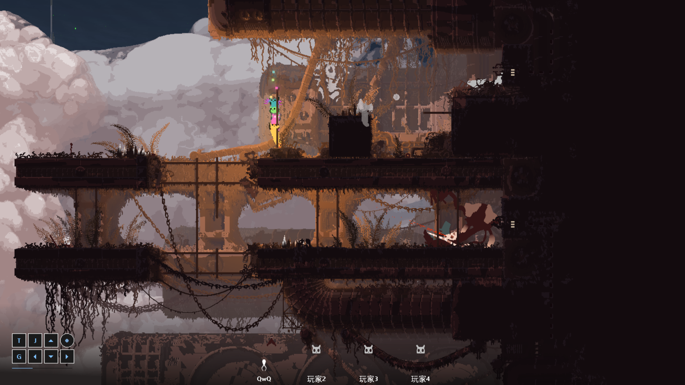

  fp: 65% - 所以说我真的要加这个功能吗，这不是纯纯的给写文太太增加工作量吗，而且万一我开摆了没找人来写，这个功能还得关

 srs: 55% - 啊这，还得给氧气面罩改贴图

 nsh: 40% - 不出意外的话，技能做完了，但很有可能出意外

moon: 23% - 下一步是修改传送逻辑，虽然传送函数已经写好了，但在同一个房间里就传送观感不是很好

新地图：3% - 只有一坤个房间，草稿还没画完呢

已知问题：
- 不兼容Dress My Slugcat，同时启用会让游戏在加载moon的图形的时候崩溃。我还有一个能兼容但不能正常显示图形的办法，是时候做出抉择了（
- 角色解锁文本需要重启游戏才能刷新，但这不影响你开玩
- 读珍珠功能暂不支持任何自定义珍珠。我可能会联系一下Custom Region Support的作者，或者想点别的办法（但更有可能是直接开摆

如你所见，这只魔王鹫已经在这蛄蛹了一整个雨循环了
